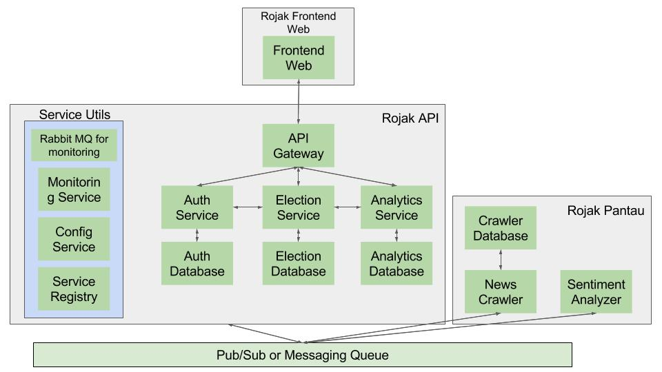

# Rojak

This is the main project repository of [kawalmedia.id](http://kawalmedia.id) (Coming Soon).

## What is Rojak in the world?

Rojak is a **non-profit** and open source project used for observing online news
website in any election in Indonesia. It can be useful for doing some news data
analytics in presidential, governor, or even major election. This project actually was
initialized at the very first time at October 2016 [here](https://github.com/pyk/rojak),
to observe the 2017 governor election in DKI Jakarta. However, because there were some
unfinished tasks on our first initiative, we weren't able to release this project
to production. However, since the responses/contributions from the developer community was
extremely good at that time, we have been thinking about restarting this initiative
and coming up with new requirements for the incoming election in Indonesia.

### Why Rojak?

In the long journey of an public election, our citizen usually get informations about
the election candidate from the online news site. Unfortunately, some of the
online media tend to take a side in one of the election candidates. This can create
bias to some/most of the informations published on the site. It could give
positive impact for a candidate they take the side with, or even bad impact to
another candidate and vice versa. Unfortunately, it might give some impact to
all/most of the citizen's sentiment about one or more candidates.

By developing this project, we really have a huge hope that we can increase the
awareness of our citizens by providing them the analytical data about how news media
creates stories and takes a side in an election. Besides, by contributing to this
open source project, we hope that we will be able to stimulate more developers
in Indonesia to contribute to open source software community.

### kawalmedia.id?

Ultimately, we are going to call this project as **kawalmedia.id**. The usage of **Rojak**
as the name of this project is to preserve the original initiative of this project.

## System Architecture

There are 4 main applications running for this project. They are:
* Rojak Frontend Web
* Rojak API
* Rojak Pantau
* Pub/Sub Application. This might gonna be Kafka/Redis/GCP Pubsub.

## How to contribute

This application consists of 3 main parts and each part will have its own github
repositories. They are `rojak-pantau` (includes crawler and machine learning),
`rojak-api` (RESTful API server built by Spring Boot and Spring Cloud) and
`rojak-web-frontend` (built by ReactJs).

To contribute, please create Pull Request from specific git repositories, instead of
to this repository. FYI, each project will have list of TODO's located on
`Project` tab in each repository. If you are interested in one of the task given
there, please convert the task into an issue and assign the issue to yourself.

When you made pull request, please specify which issue that the PR referred to.
Please check [this](https://github.com/blog/1506-closing-issues-via-pull-requests)
following article to get more information about how to do so.
